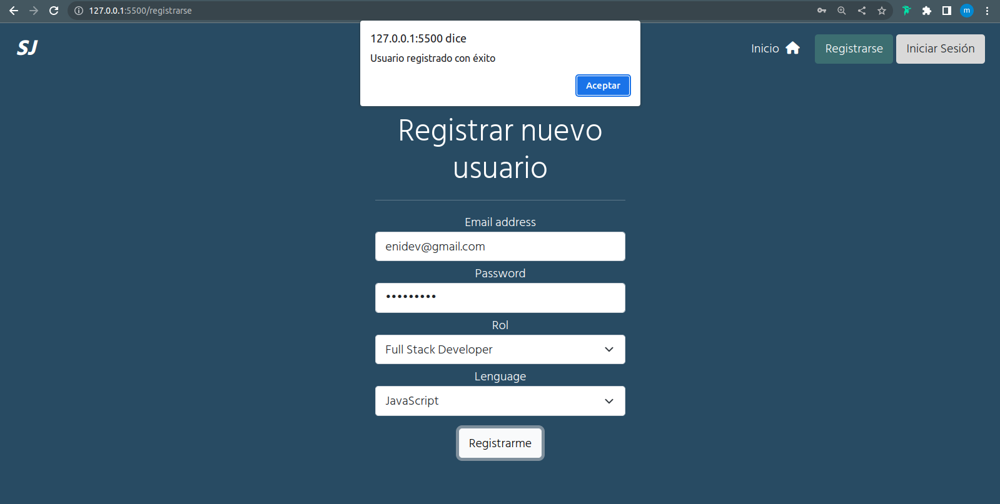
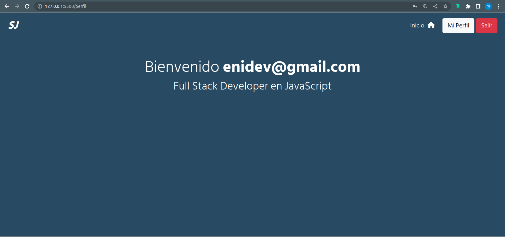

## SCREENSHOT 





---

## CREAR DB Y TABLA

Correr el script en psql: 

```sql
CREATE DATABASE softjobs;
\c softjobs;
CREATE TABLE usuarios ( id SERIAL, email VARCHAR(50) NOT NULL, password
VARCHAR(60) NOT NULL, rol VARCHAR(25), lenguage VARCHAR(20) );
INSERT INTO usuarios VALUES (DEFAULT, 'john_doe@gmail.com', 'johndoe123', 'admin', 'javascript');
SELECT * FROM usuarios;
```

Entrar en el proyecto **backend** para instalar las dependencias y ejecutar el servidor:  

```bash
cd backend
npm install
npm run dev
```

---

### ABRIR LA APP CLIENTE

Entrar el proyecto de **frontend** y abrir el archivo **index.html** con un servidor web ya sea la extensión de visual studio code **live server** u otra herramienta.